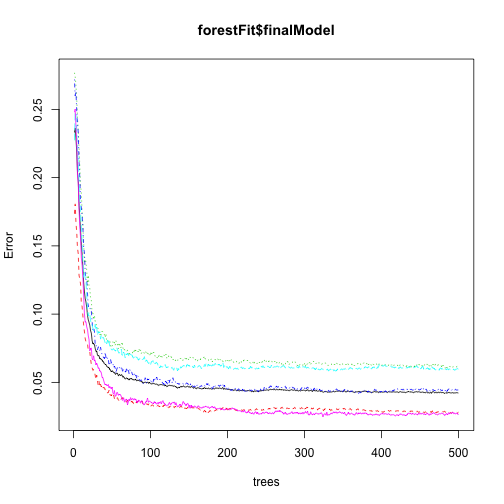

### Problem 
In this project, a predictive model for human activity recognition is built from data on how accurately an exercise is performed. Specifically, the model determines how well a Unilateral Dumbbell Biceps Curl is performed, given five classes of quality for performing the exercise.

The data were obtained from 

Velloso, E.; Bulling, A.; Gellersen, H.; Ugulino, W.; Fuks, H. **Qualitative Activity Recognition of Weight Lifting Exercises**. Proceedings of 4th International Conference in Cooperation with SIGCHI (Augmented Human '13) . Stuttgart, Germany: ACM SIGCHI, 2013.

### Procedure

After reading in the data, an exploratory data analysis was performed, which suggested the removal of certain variables from the set of possible predictors. Having done this, the variables that were highly correlated with each other were identified, and also those which explained most of the variability within the data via Principal Components Analysis. It was determined that most of the variability in the data was explained by the first 10 principal components, and these were used to fit a random tree model to a subset of the training data. The resulting model was evaluated with the complement of training set for its predictive strengths, and out of sample error rates. 

1. Reading in the data

```r
rm(list = ls())
packages<-c("ggplot2", "randomForest", "caret", "rattle")
sapply(packages, require, character.only = TRUE, quietly =T)
```

```
##      ggplot2 randomForest        caret       rattle 
##         TRUE         TRUE         TRUE         TRUE
```

```r
getdata<-function(fileUrl, dir, filename, ext){
        # create directory, if it is not already present
        dirName<-paste(dir, sep = "")
        if(!file.exists(dirName)){
                dir.create(path = dirName)
        }
        # Get the data, unless this step has already been done
        dest<-paste("./", dirName,"/", filename, ext, sep = "")
        if(!file.exists(dest)){
                download.file(url = fileUrl, 
                              destfile = dest, 
                              method = "curl") 
                datedownloaded<-date()
        }
        dest
}
trainingURL<-"https://d396qusza40orc.cloudfront.net/predmachlearn/pml-training.csv"
testingURL<-"https://d396qusza40orc.cloudfront.net/predmachlearn/pml-testing.csv"
trainingdata<-getdata(fileUrl = trainingURL, 
                      dir = "activityData", 
                      filename = "training", 
                      ext = ".csv")
if(!exists("training")){
        training<-read.csv(trainingdata,
                           header = T,
                           sep = ",",
                           na.strings = c("NA", "") )
}
testingdata<-getdata(fileUrl = testingURL, 
                     dir = "activityData", 
                     filename = "testing", ext = ".csv")
if(!exists("testing")){
        testing<-read.csv(testingdata, 
                          sep = ",",
                          na.strings = c("NA", "") )
}
# dimensions of the test and training data
c(dim(training), dim(testing))
```

```
## [1] 19622   160    20   160
```

2. Exploratory Data Analysis, and discarding of certain variables


```r
# identify how many columns are sparse
table(apply(training, 2, function(x) length(which(!is.na(x)))))
```

```
## 
##   406 19622 
##   100    60
```

```r
# obtain a vector of column names that are non-sparse
nums<-apply(training, 2, function(x) length(which(!is.na(x))))
keepnames<-names(nums)[nums>406]
colNums<-match(keepnames, names(training))
# subset the training data to remove columns that give only identification and time stamp information, and keep the columns computed in the previous step
training<-training[,keepnames]
training<-training[,-c(1:7)]
table(apply(training, 2, function(x) length(which(!is.na(x)))))
```

```
## 
## 19622 
##    53
```

```r
dim(training)
```

```
## [1] 19622    53
```

3. Identification of highly correlated variables and the most influential principal components


```r
## identify the variables that have a high correlation with each other

# find the variables which are highly correlated
corMat<-abs(cor(training[,-53]))
diag(corMat)<-0
# list the names of highly correlated variables
which(x = corMat > 0.9, arr.ind = T)
```

```
##                  row col
## total_accel_belt   4   1
## accel_belt_y       9   1
## accel_belt_z      10   1
## accel_belt_x       8   2
## roll_belt          1   4
## accel_belt_y       9   4
## accel_belt_z      10   4
## pitch_belt         2   8
## roll_belt          1   9
## total_accel_belt   4   9
## accel_belt_z      10   9
## roll_belt          1  10
## total_accel_belt   4  10
## accel_belt_y       9  10
## gyros_arm_y       19  18
## gyros_arm_x       18  19
## gyros_dumbbell_z  33  31
## gyros_forearm_z   46  31
## gyros_dumbbell_x  31  33
## gyros_forearm_z   46  33
## gyros_dumbbell_x  31  46
## gyros_dumbbell_z  33  46
```

```r
# obtain the principal components of the training set
prComp<-prcomp(training[, -53])
# view the amount of varaiblity explained by the principal components
plot(prComp, type="lines")
```

 

4. Building the predictive model, based on the top ten most influential PCs. The training set is split into a smaller training set and its complement for cross validation. A random forest was built on this smaller training set, while the smaller test set was put aside until the evaluation phase  


```r
set.seed(123)
# partition the data into a smaller training and test set
inds<-createDataPartition(y = training$classe, p = 0.75, list = F)
smallTraining<-training[inds,]
smallTesting<-training[-inds,]
# obtain the ten most significant principal components
preProc<-preProcess(x = smallTraining[, -53], 
                    method = "pca", 
                    pcaComp = 10)
# fit the principal components to the training data 
trainPC<-predict(preProc, smallTraining[,-53])
## build a model for predicting exercise class from the PC model with 5-fold cross validation

# fit  random forest model
forestFit<-train(smallTraining$classe ~., 
              method = "rf", 
              data = trainPC, 
              proximity = T, 
              trControl = trainControl(method = "cv", 
                                       number = 5, 
                                       allowParallel = T)
              )
forestFit
```

```
## Random Forest 
## 
## 14718 samples
##     9 predictor
##     5 classes: 'A', 'B', 'C', 'D', 'E' 
## 
## No pre-processing
## Resampling: Cross-Validated (5 fold) 
## 
## Summary of sample sizes: 11774, 11774, 11775, 11774, 11775 
## 
## Resampling results across tuning parameters:
## 
##   mtry  Accuracy  Kappa  Accuracy SD  Kappa SD
##    2    0.9       0.9    0.003        0.004   
##    6    0.9       0.9    0.004        0.005   
##   10    0.9       0.9    0.004        0.005   
## 
## Accuracy was used to select the optimal model using  the largest value.
## The final value used for the model was mtry = 2.
```

```r
plot(forestFit$finalModel)
```

 

5. Evaluating the fit model
The computed model has an in-sample accuracy of 94.8%, but this is optimistic. It was it was tested against the training set


```r
smallTestingPC<-predict(preProc, smallTesting[, -53])
confusionMatrix(smallTesting$classe, predict(forestFit, smallTestingPC))
```

```
## Confusion Matrix and Statistics
## 
##           Reference
## Prediction    A    B    C    D    E
##          A 1354   10   14   10    7
##          B   17  905   18    6    3
##          C   13   22  795   19    6
##          D   11    4   55  732    2
##          E    7    4    7    7  876
## 
## Overall Statistics
##                                         
##                Accuracy : 0.951         
##                  95% CI : (0.944, 0.957)
##     No Information Rate : 0.286         
##     P-Value [Acc > NIR] : <2e-16        
##                                         
##                   Kappa : 0.938         
##  Mcnemar's Test P-Value : 0.01          
## 
## Statistics by Class:
## 
##                      Class: A Class: B Class: C Class: D Class: E
## Sensitivity             0.966    0.958    0.894    0.946    0.980
## Specificity             0.988    0.989    0.985    0.983    0.994
## Pos Pred Value          0.971    0.954    0.930    0.910    0.972
## Neg Pred Value          0.986    0.990    0.977    0.990    0.996
## Prevalence              0.286    0.193    0.181    0.158    0.182
## Detection Rate          0.276    0.185    0.162    0.149    0.179
## Detection Prevalence    0.284    0.194    0.174    0.164    0.184
## Balanced Accuracy       0.977    0.973    0.940    0.964    0.987
```
Testing against the test set allows us to say with 95% confidence that the accuracy of the model is between 94.42% and 95.65%, which seems fairly good. The out of sample error rate is 


```r
1-.948
```

```
## [1] 0.052
```

Testing against the downloaded testing set 

```r
# preprocess the testing set in the same way as the training set 
testing<-testing[, colNums]
testing<-testing[, -c(1:7)]
bigTestingPC<-predict(preProc, testing[, -53])
# predict the exercise class
answers<-predict(object = forestFit, bigTestingPC)
answers
```

```
##  [1] B A A A A E D B A A A C B A E E A B B B
## Levels: A B C D E
```

Of the twenty predicted values, eighteen were correct. 
